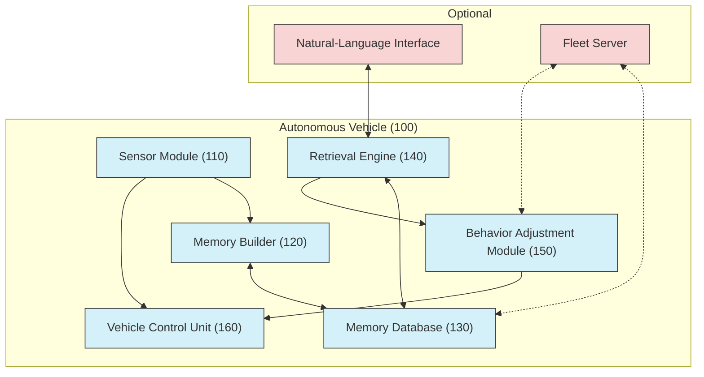
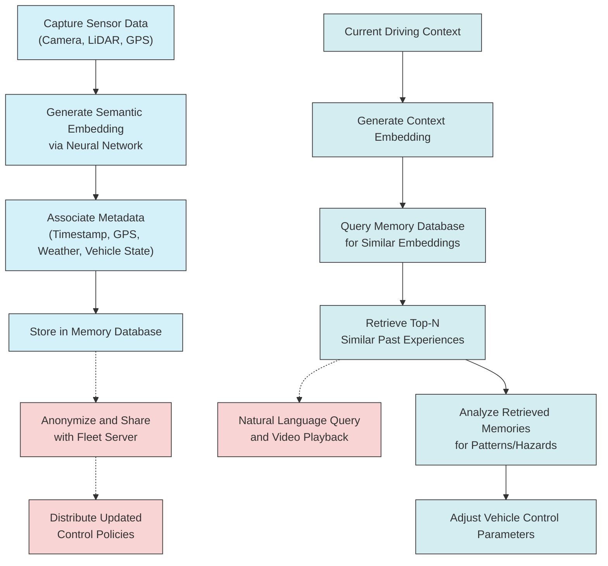
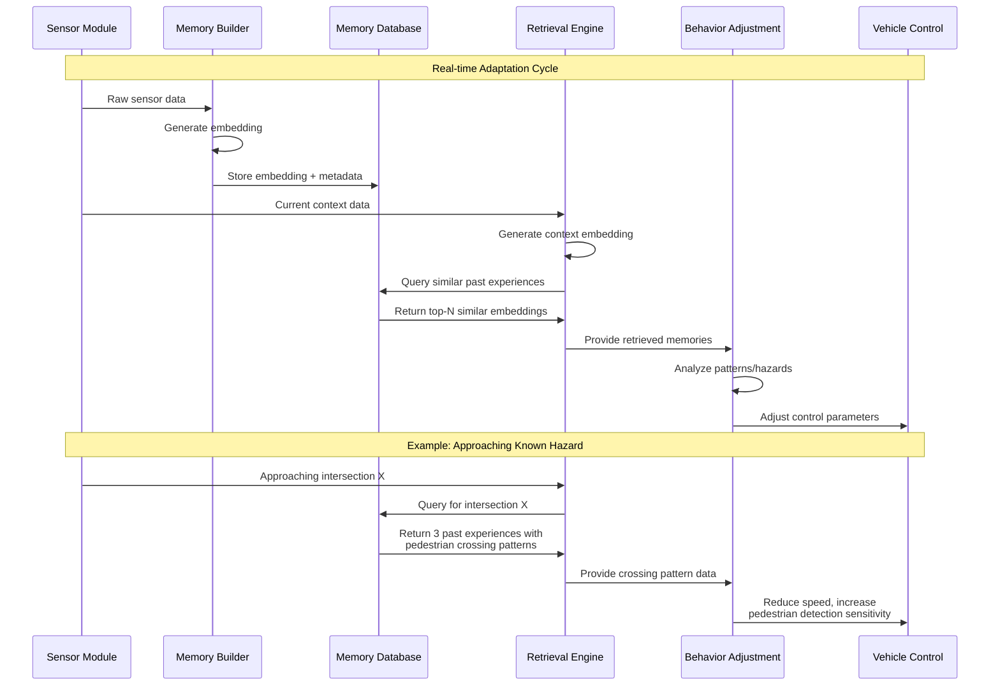
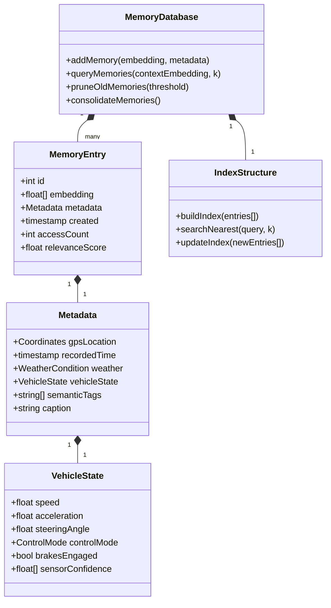

**SYSTEM AND METHOD FOR ENHANCING AUTONOMOUS VEHICLE PERFORMANCE VIA RETRIEVAL-AUGMENTED LONG-HORIZON MEMORY**

---

**FIELD OF THE INVENTION**
The present invention relates generally to autonomous vehicles and, more particularly, to systems and methods for augmenting real-time vehicle control with a long-horizon, retrieval-augmented memory of past driving experiences.

---

**BACKGROUND**
Current autonomous driving systems rely principally on short-term sensor fusion—processing camera, LiDAR, radar, and ultrasonic data over time horizons on the order of seconds—to perceive the environment and execute immediate control commands. While such systems excel at highway driving and common scenarios, they can struggle with rare or location-specific edge cases (e.g., unusual construction zones, atypical roadway geometry, seasonal hazards) that were not captured sufficiently during training or testing.

Moreover, existing approaches typically lack the ability to semantically index and recall specific past events by natural-language or geospatial query, limiting transparency for drivers and preventing personalized adaptation based on individual driving history.

---

**SUMMARY OF THE INVENTION**
In accordance with one embodiment, the present invention provides an autonomous vehicle system comprising:

1. **Sensor Module** for capturing multimodal driving data (e.g., video frames, GPS coordinates, IMU readings).
2. **Semantic Memory Builder** configured to:

   * Generate semantic captions or embeddings from captured data.
   * Associate each embedding with metadata including timestamp, geolocation, weather, and vehicle state.
   * Store the embeddings and metadata in a memory database.
3. **Memory Retrieval Engine** configured to:

   * Receive a real-time driving context signal (e.g., current camera frame, GPS location, environmental conditions).
   * Formulate a similarity query against the memory database to retrieve past embeddings relevant to the current context.
4. **Behavior Adjustment Module** configured to:

   * Analyze retrieved memories to detect previously encountered hazards or driver preferences.
   * Adapt real-time planning and control parameters (e.g., braking sensitivity, lane-keeping offset) based on the analysis.

Additional embodiments include:

* A **user interface** allowing natural-language queries over the stored memory (e.g., "When did we last encounter low-visibility downtown?") and playback of annotated video snippets.
* **Fleet-wide sharing** of anonymized memory summaries to accelerate learning of rare events across multiple vehicles.

This retrieval-augmented memory framework augments existing end-to-end control pipelines with long-horizon, semantically indexed knowledge, thereby improving safety, personalization, and transparency.

---

**BRIEF DESCRIPTION OF THE DRAWINGS**

* **FIG. 1**—Block diagram of an autonomous vehicle equipped with the memory augmentation system.

* **FIG. 2**—Flowchart of the memory building and retrieval process.

* **FIG. 3**—Sequence diagram illustrating real-time adaptation based on retrieved memories.

---

**DETAILED DESCRIPTION**

Referring to FIG. 1, an autonomous vehicle 100 includes a Sensor Module 110, Memory Builder 120, Memory Database 130, Retrieval Engine 140, Behavior Adjustment Module 150, and Vehicle Control Unit 160.

1. **Sensor Module 110** continuously captures raw data from on-board sensors (e.g., cameras, LiDAR, GPS).

2. **Semantic Memory Builder 120** operates in two phases:

   * **Embedding Generation**: For each incoming video frame or LiDAR sweep, a neural network captioner or embedding model produces a semantic vector representation that summarizes key scene elements (e.g., "pedestrian crossing at twilight," "icy patch near coordinate X").
   * **Indexing**: The semantic vector is stored in Memory Database 130 along with metadata fields—timestamp, GPS coordinates, weather sensor readings, vehicle speed, and control state.

3. **Memory Database 130** may be implemented using a vector-searchable data store (e.g., FAISS, Annoy) optimized for low-latency similarity queries and high storage efficiency.

4. **Retrieval Engine 140** is triggered when the vehicle enters a new driving context C (e.g., approaching an underpass at night). It formulates a nearest-neighbor query using C's current embedding and fetches the top-N semantically similar past embeddings, returning their associated metadata and raw sensor excerpts.

5. **Behavior Adjustment Module 150** analyzes the retrieved set to identify recurring patterns or hazards. For example, if several past embeddings tagged "slippery road" occurred at the same geofence segment with precipitation metadata, the module can instruct Vehicle Control Unit 160 to reduce maximum lateral acceleration or increase braking headroom.

6. **Natural-Language Interface (optional)** allows the driver to pose queries such as "Show me yesterday's incident near Maple St," which the Retrieval Engine 140 answers by returning timestamped video clips and textual annotations.

7. **Fleet Collaboration (optional)** anonymizes and aggregates memory summaries across multiple vehicles. A central server clusters semantically indexed events (e.g., "unexpected pothole on Route 22") and distributes model fine-tuning data or control parameter patches to all fleet vehicles.

Privacy and security safeguards include encryption of embeddings at rest, user opt-in for memory sharing, and fine-grained data retention policies.

---

**CLAIMS**

1. **(Independent)** A system for enhancing autonomous vehicle performance, comprising:

   * a Sensor Module configured to capture multimodal driving data;
   * a Semantic Memory Builder configured to generate semantic embeddings from the captured data and store the embeddings with associated metadata in a memory database;
   * a Retrieval Engine configured to query the memory database with a real-time driving context embedding and retrieve semantically similar stored embeddings; and
   * a Behavior Adjustment Module configured to adapt vehicle control parameters based on the retrieved embeddings.

2. The system of claim 1, wherein the metadata comprises at least one of: timestamp, geolocation, weather conditions, and vehicle state information.

3. The system of claim 1, wherein the Semantic Memory Builder comprises a neural network for generating caption-based embeddings.

4. The system of claim 1, wherein the Retrieval Engine employs approximate nearest-neighbor search over the memory database.

5. The system of claim 1, wherein the Behavior Adjustment Module adjusts at least one of: braking sensitivity, lane-keeping offset, and speed limit.

6. The system of claim 1, further comprising a Natural-Language Interface configured to receive text-based queries and present corresponding past driving events.

7. The system of claim 1, wherein the memory database is a vector-searchable data store supporting low-latency similarity queries.

8. The system of claim 1, further comprising a central fleet server configured to aggregate anonymized embeddings and metadata from multiple vehicles and distribute updated control policies based on clustered semantic events.

9. A method for improving autonomous vehicle control, comprising:

   * capturing sensor data;
   * generating a semantic embedding from the sensor data;
   * storing the semantic embedding with metadata in a memory database;
   * obtaining a real-time driving context embedding;
   * querying the memory database with the real-time embedding to retrieve similar embeddings; and
   * modifying a vehicle control parameter based on the retrieved embeddings.

10. The method of claim 9, further comprising receiving a natural-language query and presenting video snippets corresponding to retrieved embeddings.

11. The method of claim 9, further comprising aggregating anonymized embeddings from a plurality of vehicles for centralized analysis.

12. A non-transitory computer-readable medium storing instructions that, when executed by a processor of an autonomous vehicle, cause the processor to perform the method of any one of claims 9–11.

---

**PATENT ENHANCEMENT RECOMMENDATIONS**

To strengthen this patent filing, consider the following additions and refinements:

1. **Expand Technical Implementation Details**:
   * Specify vector embedding dimensions and techniques (e.g., transformer-based, contrastive learning)
   * Detail memory compression algorithms for efficient storage
   * Describe specific similarity metrics used for retrieval (cosine, Euclidean, learned metric)
   * Provide pseudocode for key algorithms, especially the memory retrieval process

2. **Add Defensive Claims**:
   * Include claims covering alternative embedding generation methods
   * Add claims for different memory database implementations
   * Include claims for various retrieval strategies (e.g., hierarchical, multi-scale)
   * Add claims covering different user interface modalities

3. **Strengthen Novelty**:
   * Emphasize the specific technical challenge of long-horizon memory in autonomous vehicles
   * Differentiate from general retrieval-augmented generation techniques
   * Highlight the unique aspects of spatiotemporal memory indexing for vehicles

4. **Add Experimental Results**:
   * Include quantitative improvements in hazard detection rates
   * Provide metrics on memory retrieval latency under various conditions
   * Document memory storage efficiency compared to baseline approaches

5. **Expand Use Cases**:
   * Detail application to specific driving scenarios (urban navigation, highway merging)
   * Describe adaptation to different weather conditions
   * Explain personalization based on driver preferences
   * Add fleet-wide knowledge sharing mechanisms

6. **Address Potential Challenges**:
   * Describe methods to handle memory database growth over time
   * Detail privacy-preserving techniques for sensitive driving data
   * Explain fallback mechanisms when relevant memories aren't available
   * Address potential memory corruption or poisoning attacks

7. **Add Diagrams**:
   * Include a diagram showing memory database structure (proposed below)
   * Add a diagram illustrating the embedding generation process
   * Create a diagram showing the user interface for memory queries

8. **Strengthen Method Claims**:
   * Add specific steps for memory pruning and consolidation
   * Include steps for handling conflicting memories
   * Detail methods for weighting recent vs. older memories
   * Specify techniques for handling out-of-distribution scenarios

These enhancements would significantly strengthen the patent's defensibility, broaden its scope, and increase its technical depth.
