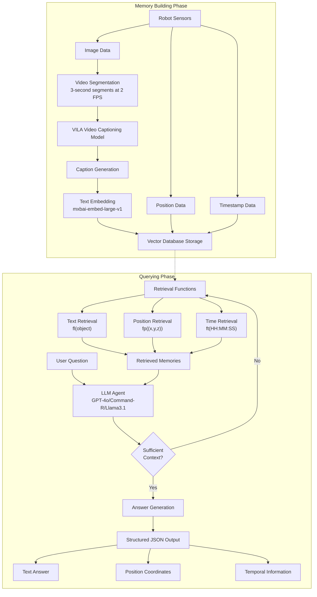
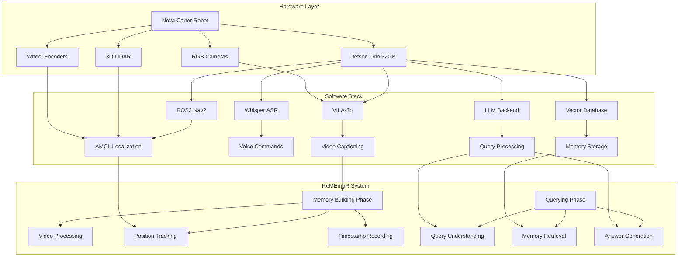
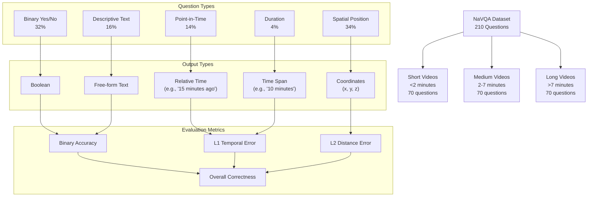

# ReMEmbR System Diagrams

This document provides visual representations of the ReMEmbR system architecture, components, and related datasets to complement the textual documentation.

## ReMEmbR Architecture Overview

The following diagram illustrates the two main phases of the ReMEmbR system: the Memory Building Phase and the Querying Phase. It shows the data flow from robot sensors through to answer generation.

### Key Components:

1. **Memory Building Phase**:
   - Processes robot sensor data (images, positions, timestamps)
   - Segments video into 3-second chunks at 2 FPS
   - Uses VILA model for video captioning
   - Embeds captions using mxbai-embed-large-v1
   - Stores embeddings along with position and timestamp data in a vector database

2. **Querying Phase**:
   - Takes user questions as input
   - Uses an LLM agent to process the question
   - Iteratively retrieves relevant memories using specialized functions
   - Generates structured answers in JSON format with text, position, or temporal information

## System Integration Diagram

This diagram shows how ReMEmbR integrates with hardware and software components in a real-world deployment.

### Key Integration Points:

1. **Hardware Layer**:
   - Nova Carter robot provides the physical platform
   - Jetson Orin 32GB serves as the compute platform
   - Sensors include RGB cameras, 3D LiDAR, and wheel encoders

2. **Software Stack**:
   - ROS2 Nav2 with AMCL handles navigation and localization
   - Whisper ASR processes voice commands
   - VILA-3b generates video captions
   - Vector database stores and retrieves memories
   - LLM backend processes queries

3. **ReMEmbR System**:
   - Memory Building Phase processes sensor data
   - Querying Phase handles user interactions and memory retrieval

## NaVQA Dataset Structure

This diagram illustrates the structure of the NaVQA dataset used to evaluate ReMEmbR, including question types, output formats, and evaluation metrics.

### Key Dataset Features:

1. **Video Categories**:
   - Short videos (< 2 minutes): 70 questions
   - Medium videos (2-7 minutes): 70 questions
   - Long videos (> 7 minutes): 70 questions

2. **Question Types**:
   - Binary Yes/No questions (32%)
   - Point-in-Time questions (14%)
   - Duration questions (4%)
   - Spatial Position questions (34%)
   - Descriptive Text questions (16%)

3. **Output Types**:
   - Boolean values for yes/no questions
   - Relative time expressions for point-in-time questions
   - Time spans for duration questions
   - Coordinates for spatial questions
   - Free-form text for descriptive questions

4. **Evaluation Metrics**:
   - Binary accuracy for yes/no and descriptive questions
   - L1 temporal error for time-related questions
   - L2 distance error for spatial questions
   - Overall correctness as a unified metric

## Links to Related Documentation

- [ReMEmbR Architecture](remembr_architecture.md) - Detailed technical analysis
- [NaVQA Dataset Analysis](navqa_dataset.md) - Comprehensive dataset information
- [Experimental Results](experimental_results.md) - Performance evaluation
- [Real-World Applications](real_world_applications.md) - Deployment case studies
- [Technical Challenges](technical_challenges.md) - Research challenges and future directions 